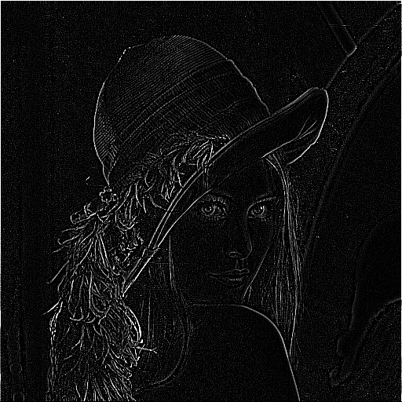

# Image Filtering with CUDA NPP (NVIDIA Performance Primitives)

## Overview

This project is designed to explore various image filtering techniques using the CUDA NPP (NVIDIA Performance Primitives) Library. The project currently implements the following image filters:

* **Median Filter (median)**: This filter reduces noise in an image while preserving edges by replacing each pixel's value with the median value of the neighboring pixels.
* **Sharpening Filter (sharpen)**: This filter enhances the edges of an image by emphasizing the differences between neighboring pixel values, making the image appear crisper.
* **Laplacian Filter (laplacian)**: A filter that detects edges by calculating the second derivative of the image intensity, highlighting regions of rapid intensity change.

The project allows users to specify an input image file (in .PGM format) and choose the desired filter.

## Example Filter Output

Here are some example images showing the effects of the filters applied:

### Example of Median Filter


### Example of Sharpening Filter


### Example of Laplacian Filter



## Directory Structure

* **[`bin/`](./bin/)**: Executable files generated during the build process.
  
* **[`data/`](./data/)**: Example data files.
  
* **[`lib/`](./lib/)**: External libraries not managed by package managers.
  
* **[`src/`](./src/)**: Hierarchical source code for the project.
  
* **[`README.md`](./README.md)**: Documentation outlining project usage and setup.
  
* **[`Makefile`](./Makefile)** Automating the build process.
  
* **[`run.sh`](./run.sh)**: Optional script for executing compiled code.

## Running the Project

Running the Project will generate an output log file located at **[`./output/output.log`](./output/output.log)**
To run the project, you have a couple of options:

1. **[`run.sh`](./run.sh)**:

   ```sh
   sh run.sh
   ```

2. **[`Makefile`](./Makefile)**
  
   ```sh
   make clean build
   make run ARGS="-input=./data/Lena.pgm -kernel=laplacian" >> output/output.log
   ```

   **Note:** When no -kernel argument is specified all kernels will be executed fot the given input image

   ```sh
   make run ARGS="-input=./data/Lena.pgm" >> output/output.log
   ```

**Context:** This project was developed as part of the **CUDA at Scale for the Enterprise** course offered by **Johns Hopkins University**.

**Note:** This project is intended to run within the Coursera Lab environment, which comes with a pre-configured CUDA setup. The structure of the project draws inspiration from the [CUDA at Scale for the Enterprise Course Project Template](https://github.com/PascaleCourseraCourses/CUDAatScaleForTheEnterpriseCourseProjectTemplate).

## Future Implementations

Future enhancements may include adding support for filters on additional file formats, such as `.bmp` and `.png`..
